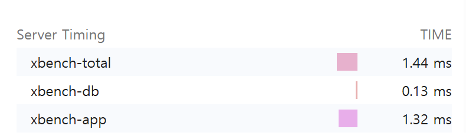
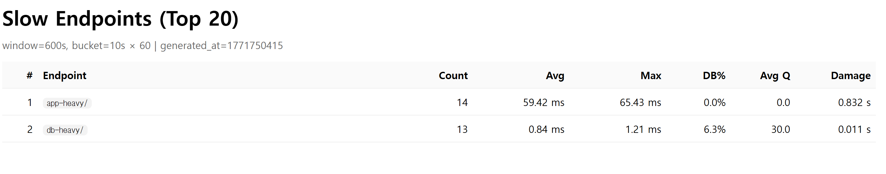

# django-xbench

> Lightweight Django middleware for APM-style request profiling  
> Measure DB vs App time and query count with near-zero configuration.

### Why django-xbench?

- 🔍 **DevTools visibility**: See DB vs app/serialization time in Chrome DevTools via `Server-Timing`.
- 🚀 **Zero-agent**: No daemon, no SaaS — just one Django middleware.
- 🧩 **Drop-in**: Near-zero configuration (add middleware and go).
- 🔒 **Privacy-first**: Exposes timing + query counts only (**no query contents stored**).

> Goal: make performance bottlenecks “visible” (DB vs app/serialization) without heavyweight APM.

Here's how django-xbench exposes request timing breakdown using the Server-Timing header:





Adds `Server-Timing` and `X-Bench-Queries` headers and optionally logs per-request metrics.

## Features

- ✅ Measures total request time and DB time (via `connection.execute_wrapper`)
- ✅ Calculates app time (= total - db)
- ✅ Counts DB queries
- ✅ Adds response headers:
  - `Server-Timing: xbench-total;dur=..., xbench-db;dur=..., xbench-app;dur=...`
  - `X-Bench-Queries: <int>`
- ✅ Optional logging:
  - `[XBENCH] GET /path | xbench_total=...ms xbench_db=...ms xbench_app=...ms q=...`
- ✅ Slow endpoint aggregation (in-memory, per process) + simple dashboard (experimental)
- ✅ Tested with `pytest` + `pytest-django`

## Installation

```bash
pip install django-xbench
```

For local development (this repository):

```bash
pip install -e ".[dev]"
```

## Quickstart

1) Add middleware in your `settings.py`:

```py
MIDDLEWARE = [
    # Recommended: place near the top to approximate end-to-end server time
    # (includes other middleware overhead).
    "django_xbench.middleware.XBenchMiddleware",

    # ... other middleware ...
]
```

2) Run your server and hit any endpoint:

**In your project:**
```bash
python manage.py runserver
curl -I http://127.0.0.1:8000/<your-endpoint>/
```

**In this repo (demo):**
```bash
# macOS / Linux
export DJANGO_SECRET_KEY="dev"
python -m examples.manage runserver --noreload
curl -I http://127.0.0.1:8000/db-heavy/
```

```powershell
# Windows PowerShell
$env:DJANGO_SECRET_KEY="dev"
python -m examples.manage runserver --noreload
curl -I http://127.0.0.1:8000/db-heavy/
```

You should see headers similar to:

```text
Server-Timing: xbench-total;dur=12.345, xbench-db;dur=1.234, xbench-app;dur=11.111
X-Bench-Queries: 3
```

## Output

### Server-Timing

Example:

```text
Server-Timing: xbench-total;dur=52.300, xbench-db;dur=14.100, xbench-app;dur=38.200
```

- `xbench-total`: whole request duration
- `xbench-db`: total DB time measured by wrapper
- `xbench-app`: `max(0, total - db)` (serialization/template/python time etc.)

You can inspect this in Chrome DevTools → Network → Timing  
(or any browser that supports the Server-Timing spec).

### Query count header

```text
X-Bench-Queries: 5
```

## Configuration

django-xbench supports two configuration styles.

### Preferred: `XBENCH` dict

Use a single `XBENCH` dictionary to keep settings compact and grouped:

```py
XBENCH = {
    "ENABLED": True,       # default: True
    "LOG": False,          # default: False
    "LOG_LEVEL": "info",   # "info" or "debug"
    "SLOW_AGG": False,     # default: False
}
```

### Legacy (still supported)

Older flat settings are still supported:

```py
XBENCH_ENABLED = True
XBENCH_LOG_ENABLED = True
XBENCH_LOG_LEVEL = "debug"
XBENCH_SLOW_AGG_ENABLED = True
```

## Slow endpoint dashboard (experimental)

This feature keeps an in-memory rolling window of endpoint timings (per process) and shows the slowest endpoints by "damage" (total accumulated latency).

### Enable aggregation

```py
XBENCH = {"SLOW_AGG": True}
```

### Expose developer endpoints (do not expose publicly)

In your project's `urls.py`:

```py
from django.urls import include, path

urlpatterns = [
    # ... your urls ...
    path("__xbench__/", include("django_xbench.slowagg.urls")),
]
```

### Endpoints

- JSON snapshot: `GET /__xbench__/slow/?n=20`
- HTML dashboard: `GET /__xbench__/slow/ui/?n=20`

### Notes

- Aggregation is **in-memory per process**. If you run multiple workers/processes, each one has its own rolling window.
- Intended for debugging / internal visibility, not as a full distributed APM.
- **DB%**: db_total / total
- **Avg Q**: average DB queries per request
- **Damage**: total accumulated latency in the window (sum of durations)

### No data yet?

The dashboard only shows data after requests occur.

If you see "No data yet":

1. Make sure `SLOW_AGG` is enabled
2. Hit some endpoints (e.g. `/db-heavy/`)
3. Refresh the dashboard

If using Django runserver with auto-reload, aggregation resets on reload.

### Advanced tuning (optional)

```py
XBENCH = {
    "SLOW_AGG": True,
    "SLOW_BUCKET_SECONDS": 10,   # bucket size in seconds
    "SLOW_BUCKET_COUNT": 60,     # number of buckets (window = bucket_seconds * bucket_count)
    "SLOW_ENDPOINT_CAP": 200,    # max unique endpoints per bucket (overflow goes to "__other__")
}
```

## Development

### Run tests

```bash
pytest
```

> Note: this repo includes a bundled `examples/` Django project used by `pytest-django`.
> In CI, we set `PYTHONPATH=examples` to ensure `examples.config.settings` can be imported reliably.

If you want to see logs while testing:

```bash
pytest -s
```

### Demo project (bundled)

This repository includes an `examples/` Django project for manual testing.

Run it from the repository root:

```bash
# macOS / Linux
export DJANGO_SECRET_KEY="dev"
python -m examples.manage runserver --noreload
```

```powershell
# Windows PowerShell
$env:DJANGO_SECRET_KEY="dev"
python -m examples.manage runserver --noreload
```

Try a few endpoints:

```bash
curl -I http://127.0.0.1:8000/db-heavy/
curl -I http://127.0.0.1:8000/app-heavy/
curl -I http://127.0.0.1:8000/admin/login/
```

## Compatibility

- Python: 3.9+
- Django: 3.2+ (tested on 5.2)

## Roadmap

- [ ] DRF serialization time breakdown (view/serializer timing)
- [ ] More robust `Server-Timing` merging (preserve existing metrics)
- [ ] Docs: real-world examples (N+1 detection demo endpoints)
- [ ] Slow endpoint dashboard: auto-refresh UI and better filtering

## Contributing

Issues and PRs are welcome.  
If you propose new metrics, please include:

- minimal reproducible example
- tests
- documentation update

## License

MIT
